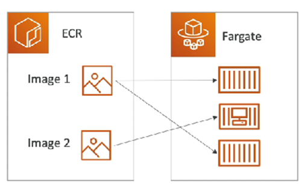

# Section 10: Other Compute Service: ECS, Lambda, Batch, Lightsail
1.	Docker
2.	ECS, Fargate & ECR
  - ECS: Elastic Container Service
    - Lauch Docker containers on AWS.
    - MUST provision & maintain the infrastructure (= EC2 instances)
    - AWS take care of starting/stopping containers.
    - Integration with Application Load Balancer: Any time it has a new Docker container, automatically find which EC2 instance to place that.
  - Fargate
    - Lauch Docker containers on AWS.
    - DO NOT provision the infrastructure (no EC2 instances)
    - Serverless (don’t manage any servers, instead AWS runs containers base on the CPU/RAM needed)
    
  - ECR: Elastic Container Registry
    - Private Docker Registry on AWS.
    - Use to store the Docker images to run by ECS/Fargate (the container can be created by those images).
    