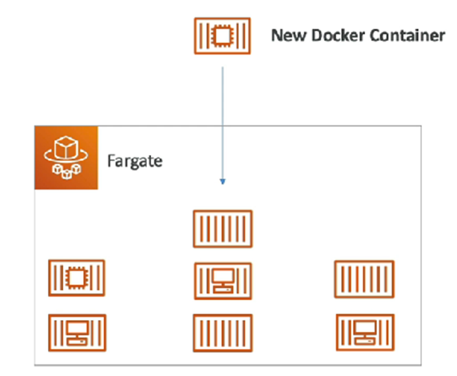
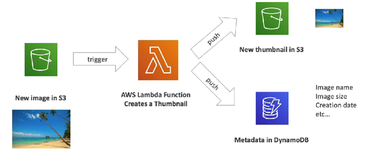
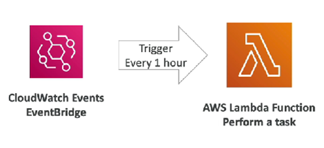

# Section 10: Other Compute Service: ECS, Lambda, Batch, Lightsail
1. **Docker**
2. **ECS, Fargate & ECR**
  - ECS: (Elastic Container Service)
    - Lauch Docker containers on AWS.
    - MUST provision & maintain the infrastructure (= EC2 instances)
    - AWS take care of starting/stopping containers.
    - Integration with Application Load Balancer: Any time it has a new Docker container, automatically find which EC2 instance to place that.
  - Fargate
    - Lauch Docker containers on AWS.
    - **DO NOT** provision the infrastructure (no EC2 instances)
    - Serverless (don’t manage any servers, instead AWS runs containers base on the CPU/RAM needed)
    
  - ECR: (Elastic Container Registry)
    - Private Docker Registry on AWS.
    - Use to store the Docker images to run by ECS/Fargate (the container can be created by those images).
    
3. **Serverless**
  -	New paradigm, developers don’t have to manage servers anymore… (just need to deploy code/function)
  - Serverless  Function as a Service (Developer manage the function (code))
  -	Initially, it was pioneered by AWS Lambda, but now also includes anything that’s managed: “database, messaging, storage, …
  -	Doesn’t mean there are no servers (just don’t mange/provision/see them)
4. **Lambda**
  - With EC2:
    - **Virtual Servers** in the cloud.
    - Limited by **RAM + CPU**.
    - **Continuously** running.
    - Scaling means intervention to add/remove servers.
=> Slow, complicated to implement.
  - Lambda:
    - A virtual function (no servers to manage).
	- Limited by time (short executions ~15min)
    - Run on-demand.
    - Automated Scaling.
  - Benefit:
    - Pay per request + compute time. (**Free tier**: 1M request + 400k GBs of compute time.)
    - Integrated with:
      - The whole AWS suite of services.
      - Many programming languages.
    - Event-Driven: Functions get invoked by AWS when needed.
    - Easy:
      - Monitoring (through AWS CloudWatch).
      - Get more resources per function (up to 10GB RAM, also improve CPU + Network).
  - Support many programming languages:
    - Node.js, Java, Python, C#, Golang, …
    - Lambda Container Image (Allow to run actual Docker containers on Lambda)
      - The container image must implement the Lambda Runtime API (Not the case for every single Docker image  Specific Docker Image). => Prefer ECS/Fargate for running arbitrary Docker images.
  - Example:
    - Serverless Thumbnail creation:
    
    - Serverless CRON Job (define a schedule to run script base on that):
    
  - Pricing: Very cheap => Very popular
    - Pay per call: Free for first 1M requests, then $0.2/1M requests thereafter.
    - Pay per duration (increment of 1ms): = time runs * RAM provisioned 
      - Free for 400kGBs/month: 
        - <=> 400.000s if function is 1GB RAM.
        - <=> 3.200.000s if function is 128MB RAM.
      - After that: $1/600kGBs
