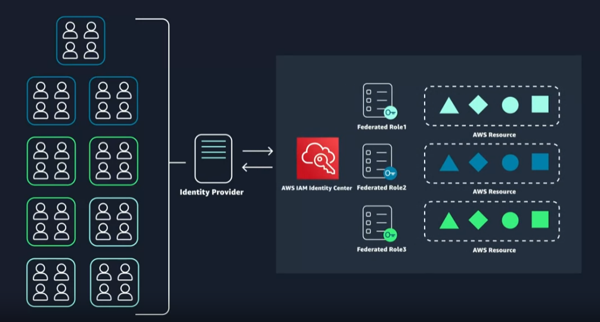

### AWS Identity and Access Management
1. **Introduction**
- Access Management in AWS:
  - Users need valid credentials, such as a username and password, to log into the employee directory application, which is an example of application-level access management.
  - API calls made from the application code running on Amazon EC2 to Amazon S3 require signed and authenticated requests, highlighting the need for credential management.
- AWS Identity and Access Management (IAM):
  - IAM is global services -> Can use on any regions.
  - Manage login permission (to AWS account) and credentials (for API calls to AWS services). Not responsible for application level access management.
  - IAM allows the creation of unique users for each person needing access to the AWS account, ensuring proper authentication.
  - Authorization is managed through IAM policies, which define what actions (AWS API calls) users can perform within the AWS account, using JSON-based documents to specify permissions (Grant/Deny)
  - IAM Policy 
    - Example:  
    
      - _Version_:  Defines the version of the policy language. 
      - _Effect_: Action (Allow/Deny)
      - _Action_: AWS API call (EC2:* -> All related EC2 actions)
      - _Resource_: Restrict which AWS resources are allowed to be performed.
      - _Condition_: Condition to restrict more.
    - Required fields:  
    
    - IAM Policy can be attached to a specific user / group.  
    
  
  - IAM Groups:
    - All users that in a group would inherit the permissions.
    - Hierarchy of IAM: Groups can have many users, users can belong to many groups. But groups cannot belong to groups.
      Group 1 -> User 1, User 2.
      Group 2 -> User 1, User 3.
- Best Practices for IAM:
  - Grant **LEAST** priviledge or only permission to perform a task.
  - Organizing users into groups and assigning permissions to those groups simplifies management, especially when roles change.
  - Setting up Multi-Factor Authentication (MFA) for the root user and creating an IAM user with admin permissions is recommended for enhanced security (you cannot apply a policy to the root user but you can to an IAM user).

2. **Role Based Access in AWS**  

- Understanding IAM Roles:
  - IAM roles are identities in AWS that can be assumed by users or services needing **temporary** access to AWS credentials, unlike IAM users who have static credentials.
  - No static login credentidals.
  - Roles provide **temporary** (for a configurable amount of time) credentials that are **automatically rotated**, enhancing security by reducing the risk of credential exposure.
  - Roles can be assumed programmatically by applications running on EC2 instances, allowing them to sign API requests securely.
  - Maintaining roles is easier than maintaining users.
- Creating and Using IAM Roles.
  - To create a role, you select the trusted entity (e.g., EC2) and assign permissions, such as access to S3 and DynamoDB:
    - AWS Console: IAM -> Role -> Create Role -> Select trusted entity -> Use case -> Select permission to add (can search)  
    
    *1. IAM -> Role -> Create Role*
    
    
    - Naming role and review before click "create role"
    

- Federated Access and External Identity Providers

  - IAM roles can also be used for federated users, allowing existing identity systems to grant access to AWS without creating numerous IAM users.
  - This approach is efficient for organizations with many employees needing AWS access, leveraging roles assigned through identity providers.

- Conclusion: To provide security enhancement, we can:  
  -> Lock down root account -> Use AWS Account + IAM   
  -> **LEAST** Priviledges -> IAM Policy -> (Attach) -> IAM User (1)  
                                                     -> IAM Groups -> (Inherited) <- IAM User  
                           -> IAM roles -> (Identity Provider) IAM Identity Center  