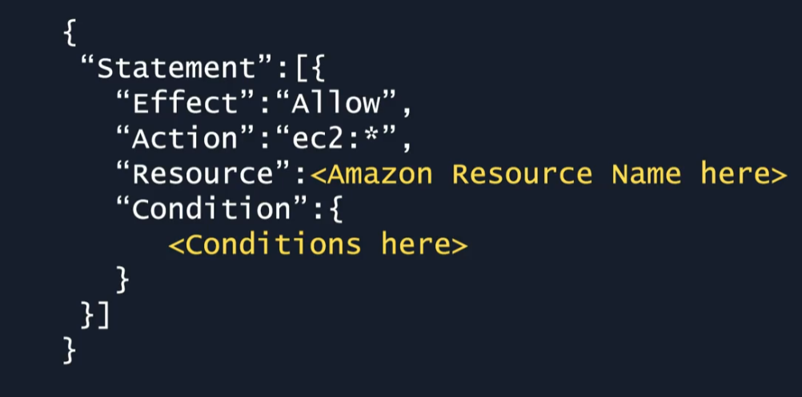
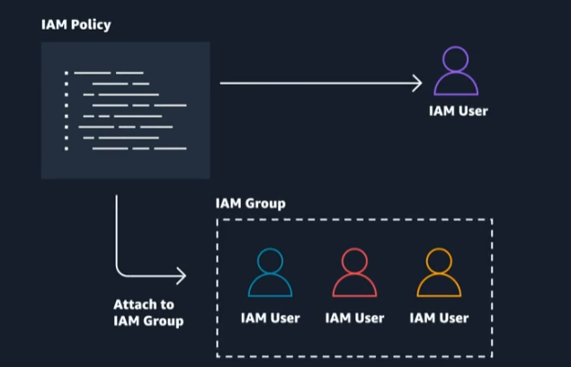

### AWS Identity and Access Management
1. INTRODUCTION
- Access Management in AWS:
  - Users need valid credentials, such as a username and password, to log into the employee directory application, which is an example of application-level access management.
  - API calls made from the application code running on Amazon EC2 to Amazon S3 require signed and authenticated requests, highlighting the need for credential management.
- AWS Identity and Access Management (IAM):
  - Manage login permission (to AWS account) and credentials (for API calls to AWS services). Not responsible for application level access management.
  - IAM allows the creation of unique users for each person needing access to the AWS account, ensuring proper authentication.
  - Authorization is managed through IAM policies, which define what actions (AWS API calls) users can perform within the AWS account, using JSON-based documents to specify permissions (Grant/Deny)
  - IAM Policy example:
  
    - _Effect_: Action (Allow/Deny)
    - _Action_: AWS API call (EC2:* -> All related EC2 actions)
    - _Resource_: Restrict which AWS resources are allowed to be performed.
    - _Condition_: Condition to restrict more.
  - IAM Policy can be attached to a specific user / group. All users that in a group would inherit the permissions
  
- Best Practices for IAM:
  - Grant *LEAST* priviledge or only permission to perform a task.
  - Organizing users into groups and assigning permissions to those groups simplifies management, especially when roles change.
  - Setting up Multi-Factor Authentication (MFA) for the root user and creating an IAM user with admin permissions is recommended for enhanced security (you cannot apply a policy to the root user but you can to an IAM user).