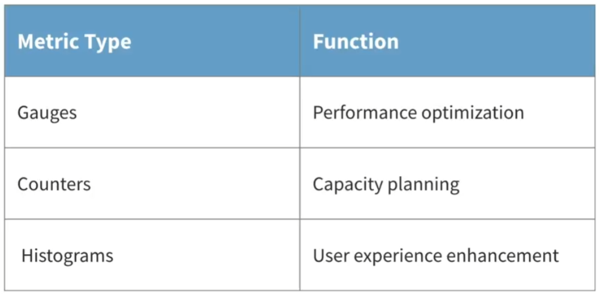

# DevOps Foundations: Monitoring and Observability
## 1. Introduction
## 2. Metrics and Monitoring
2.1. Metric types:
- Counters: 
  - What: simple, increment-only metrics that keep track of the number of occurrences of a specific event or activity.
  - Example: API requests, error occurrences, system restarts
  - When to use:
    - Want to record a value that only goes up
    - Want to be able to later query how fast the value is increasing (its rate)
- Gauges:
  - What: metrics that provide a snapshot of a particular value at a specific point in time.
  - Example: CPU, Memory utilization, number of active connections
  - When to use:
    - Want to record a value that can go up or down.
    - Don't need to query its rate.
- Histogram:
  - What: measure the distribution and frequency of time durations for specific events.
  - Example: Request duration
  - When to use:
    - Want to take many measurements of a value to later calculate averages or percentiles.
    - Not bothered about the exact values and are happy with an approximation
    - Know what the range of values will be up front -> can use the default bucket definitions or define your own.
